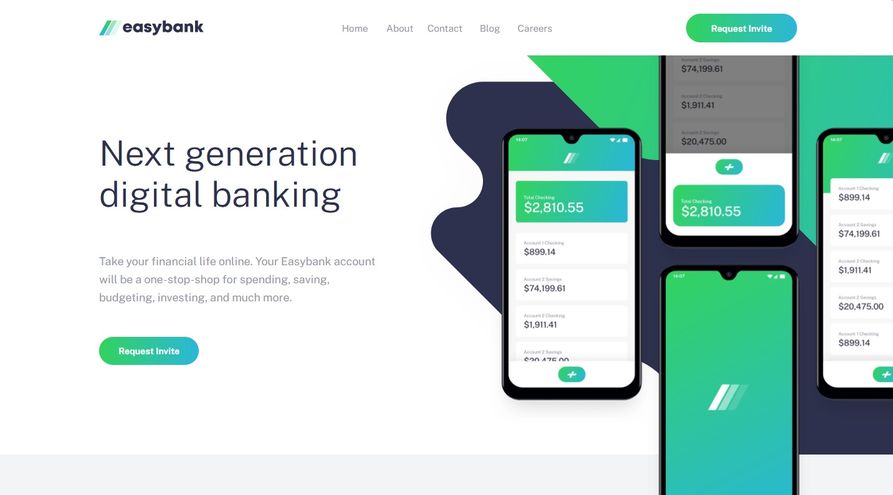

# Frontend Mentor - Easybank landing page solution

This is a solution to the [Easybank landing page challenge on Frontend Mentor](https://www.frontendmentor.io/challenges/easybank-landing-page-WaUhkoDN). Frontend Mentor challenges help you improve your coding skills by building realistic projects. 

## Table of contents

- [Overview](#overview)
  - [The challenge](#the-challenge)
  - [Screenshot](#screenshot)
  - [Links](#links)
- [My process](#my-process)
  - [Built with](#built-with)
  - [Continued development](#continued-development)
- [Author](#author)


## Overview

### The challenge

Users should be able to:

- View the optimal layout for the site depending on their device's screen size
- See hover states for all interactive elements on the page

### Screenshot



### Links

- Solution URL: [Here](https://github.com/zofiadob/easybank-landing-page-master)
- Live Site URL: [Here](https://zofiadob.github.io/easybank-landing-page-master/)

## My process

### Built with

- Semantic HTML5 markup
- Flexbox
- CSS Grid
- Mobile-first workflow
- [React](https://reactjs.org/) - JS library

### What I learned

Creating reusable components:

```html
      <div className="function-grid">
        {textes.map((block) => {
          return (
            <FunctionBox
              imgSrc={block.imgSrc}
              headerText={block.headerText}
              descText={block.descText}
            />
          );
        })}
      </div>
```

```js
export default function FunctionBox(props) {

    const {
        imgSrc,
        headerText,
        descText
    } = props

  return (
    <section className='function-box'>
        
        <h3>{headerText}</h3>
        <p>{descText}</p>
        </section>
  )
}
```

## Author

- Website - [Zofia Dobrowolska](https://zofiadob.github.io/portfolio-site/)
- Frontend Mentor - [@zofiadob](https://www.frontendmentor.io/profile/zofiadob)

